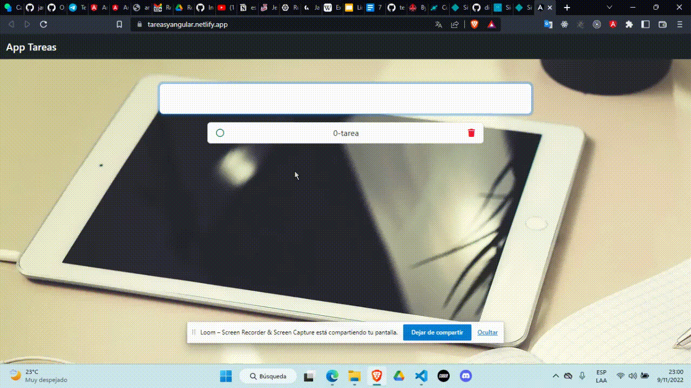

# Tareas

Aplicamos conceptos básicos de Angular. 

La app nos sirve para  agregar y quitar tareas de un día de trabajo. 

El deploy se hizo en Netlify. 

[Podemos usar el app aquí](https://tareasyangular.netlify.app/) 

